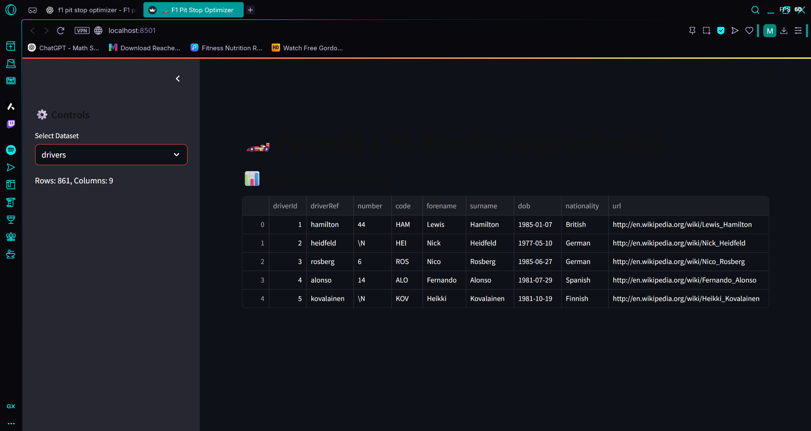
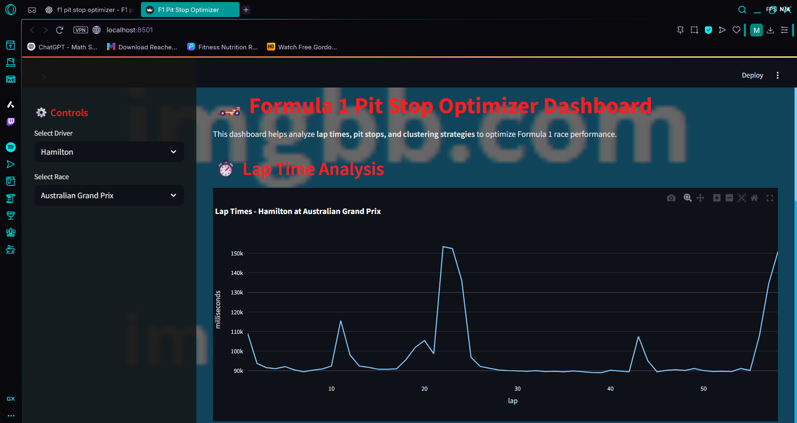

# f1-pitstop
# 🏎️ Formula 1 Pit Stop & Race Strategy Analyzer

An interactive data science and analytics dashboard built using **Streamlit**, **Pandas**, and **Scikit-Learn** to analyze historical Formula 1 race dynamics. This project leverages historical grand prix data to uncover driver performance patterns, track-specific behaviors, and pit-stop strategies using machine learning.

---

## 🚀 Key Features

### 1. Circuit Clustering Engine (Machine Learning)
* **K-Means Algorithm:** Groups historical Formula 1 circuits into structural categories based on performance metrics (e.g., average lap times, pit stop overheads, pit stop durations).
* **Interactive Exploration:** Select the number of clusters dynamically via a sidebar slider to see how different tracks categorize relative to one another.

### 2. General Performance Metrics & Distributions
* **Pit Stop Duration Distribution:** Visualizes the spread and frequency of pit stop times across different eras and tracks using interactive Plotly histograms.
* **Outlier Detection:** Highlights exceptionally fast or slow stops to analyze crew efficiency versus mechanical anomalies.

### 3. Session-Specific Race Analytics
* **Driver Lap-by-Lap Tracking:** Tracks individual driver position changes, lap-time consistency, and pace decline over a race distance.
* **Pit Stop Impact Analysis:** Breaks down exactly how a pit stop strategy influences a driver’s track position and overall race progression.

---

## 📊 Dashboard Visuals

Here is a preview of the interactive analytics modules available within the application:

### Circuit Clustering & Characteristics


### Pit Stop Duration Trends


### Driver Pace & Lap-by-Lap Metrics


---

## 🛠️ Tech Stack & Libraries

* **Frontend Framework:** Streamlit (for building the web UI dashboard)
* **Data Processing:** Pandas, NumPy
* **Machine Learning:** Scikit-Learn (K-Means Clustering)
* **Data Visualization:** Plotly Express / Seaborn / Matplotlib

---

## ⚙️ Installation & Local Setup

### 1. Clone the Repository
```bash
git clone [https://github.com/YOUR_USERNAME/f1-pit-stop-optimizer.git](https://github.com/YOUR_USERNAME/f1-pit-stop-optimizer.git)
cd f1-pit-stop-optimizer

### 2. Install Dependencies
Make sure you have Python installed, then run:

Bash
pip install streamlit pandas scikit-learn plotly
3. Run the Dashboard
Launch the interactive web server locally:

Bash
streamlit run app.py
